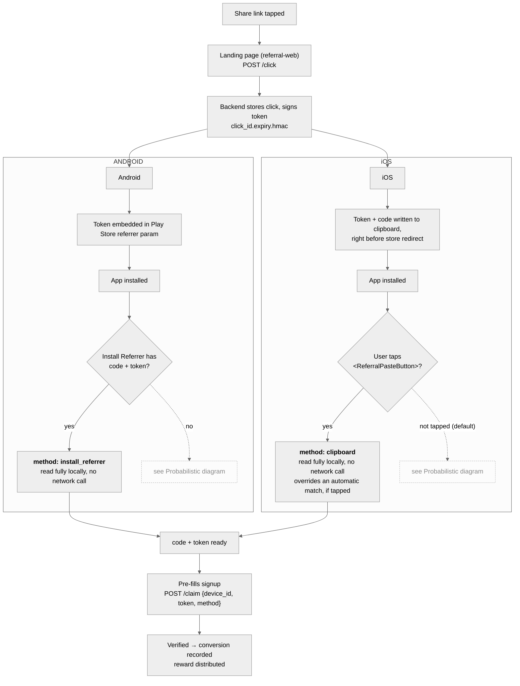
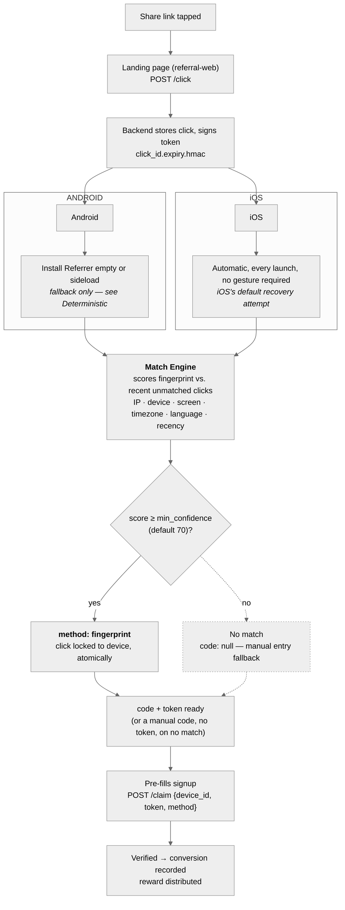

# blynk-deferlink

A deferred deep linking referral system in three installable packages plus
runnable examples. **New here?** Read this file top to bottom — it's written
as a guided path, not a reference dump: what this is, how it works, how to
run it, and where to go next depending on what you're trying to do.

```
packages/
  referral-sdk/       PHP / Composer  — backend: click store, matching, claims
  referral-sdk-node/  @blynk-deferlink/referral-sdk-node — Node.js backend (Express + Postgres), same API contract
  referral-web/       @blynk-deferlink/referral-web     — React landing page + hooks
  referral-mobile/    @blynk-deferlink/referral-mobile  — React Native code recovery
examples/
  mock-backend/       zero-dependency Node stand-in for either real backend (in-memory, not for production)
  web/                Vite React app using @blynk-deferlink/referral-web
  mobile/             Expo app using @blynk-deferlink/referral-mobile
```

## How it works

```
share link tapped → landing page stores a click, signs a token
   → user installs app → app recovers the code + token, one of two ways:

       deterministic (no network call, no guessing):
         Android reads it off the Play Install Referrer, automatically
         iOS reads it off the clipboard, only if <ReferralPasteButton> is tapped

       probabilistic (fallback, whichever platform didn't get a deterministic hit):
         a scored fingerprint match against recent unmatched clicks

   → code + token pre-fill signup → claim verifies the token,
     records the conversion, distributes the reward
```

Deterministic and probabilistic recovery are two separate mechanisms, not
two branches of one path — shown below as two diagrams, both starting at
the same click and ending at the same claim.

### Deterministic recovery

Android's default path, and iOS's opt-in path — both read a code and proof
entirely on-device, no network call. Neither touches fingerprint matching
at all.



### Probabilistic recovery

Reached only when the deterministic path above didn't run or didn't have
anything to read — a scored guess, backed by the same signed token once it
succeeds. Both platforms feed the same scoring engine; this is the one
piece of matching logic that isn't platform-specific at all.



**Reliability**: Android deterministic recovery hits ~100% of real
installs; iOS deterministic recovery depends entirely on whether the paste
button is rendered and tapped. Probabilistic matching sees an observed
~85–90% match rate on iOS, where it's the default fallback; lower priority
on Android, where it's a fallback of last resort.

Treat that iOS figure as what a *single* self-hosted deployment sees, and
don't compare it directly against a commercial MMP's published numbers.
Branch and AppsFlyer score probabilistic matches against signal pooled
across their whole SDK install base — many apps, shared IP graphs — while
this only ever sees your own clicks. That's a structural difference in
available signal, not a tuning gap you can close by adjusting weights.

**The proof that makes both deterministic paths possible**: every
recovered code carries a signed proof (`click_id.expiry.hmac`), minted
once at `/click` — this is what lets both deterministic paths stay
genuinely network-free at recovery time, and what `/claim` verifies before
any reward is paid out. A code with no valid token behind it (including
one a user typed in by hand) can reach signup, but can never clear
`/claim` — see [`docs/decisions.md`](docs/decisions.md) #21/#22 for the
full reasoning behind why this replaced an earlier redeem-round-trip
design.

---

## Compared to Branch and AppsFlyer

**Read the scope line first, because it's the part that decides whether
this is for you:** Branch and AppsFlyer are mobile measurement platforms.
blynk-deferlink is the deferred-deep-linking and referral-attribution
slice of what they do, self-hosted. If you need ad-network attribution,
this is not a replacement.

|  | blynk-deferlink | Branch / AppsFlyer |
| --- | --- | --- |
| Hosting | your infrastructure | SaaS |
| Click and conversion data | your database | their cloud |
| Cost | your hosting bill | see below |
| Source | MIT, forkable | closed |
| Vendor lock-in | none — it's your schema | re-instrumentation to leave |
| Third-party data sharing | none | governed by their terms |

### What you give up

Worth being blunt about, because it's most of what the money buys:

- **No ad-network attribution.** No SKAdNetwork, no SRNs, no Meta/Google/
  TikTok install attribution. If you're attributing paid UA spend, you
  need an MMP, and this isn't one.
- **No Universal Links / App Links setup.** This is the one most likely to
  surprise you, since it's a headline Branch feature. Branch hosts the
  `apple-app-site-association` and `assetlinks.json` files and handles
  domain verification for you; here that's yours to configure. The landing
  page does attempt to open an already-installed app via its custom URL
  scheme, but that attempt is deliberately fired into a hidden iframe and
  is effectively inert — no custom-scheme technique is both silent when the
  app is absent and functional when it's present. Only Universal Links and
  App Links solve that properly. See
  [`docs/decisions.md`](docs/decisions.md) #27 for the full reasoning.
  Deferred deep linking — the actual point of this project — works
  regardless, because it runs after install rather than at link-tap.
- **No dashboard.** There's an API and a database. Analytics, cohorting
  and campaign reporting are yours to build or bolt on.
- **No fraud detection.** Nothing equivalent to Protect360. The signed
  click token (see #21/#22 above) stops forged claims, but click-spamming
  and install-farm detection at scale are not addressed.
- **No support SLA.** It's an open-source project.
- **You run it.** A backend, a database, retention, and uptime.

### What you get instead

- The full recovery stack — Android Install Referrer, iOS clipboard
  handoff, and fingerprint matching fallback — with the reasoning for
  every non-obvious decision written down in
  [`docs/decisions.md`](docs/decisions.md).
- Attribution data that stays in your own database, which matters if
  you're in a regulated sector or somewhere data residency is a
  constraint.
- Cost that scales with your infrastructure rather than your MAU count.
  Neither vendor publishes list pricing; Branch is reported to begin
  around $500/month with contracts commonly in the $15k–$200k+/year
  range, and AppsFlyer bills roughly $0.07 per conversion after a free
  allowance, which reportedly reaches around $84k/year at 100k monthly
  conversions. Both have free tiers — Branch around 10k MAU, AppsFlyer
  around 12k lifetime non-organic installs — that are genuinely
  sufficient for small apps. Check their current pricing directly;
  these are third-party reports, not quotes.

**When to use them instead:** you're running paid acquisition and need
MMP attribution; you want fraud protection you don't have to build; or
you'd rather buy a supported product than operate one. Those are good
reasons, and this project doesn't pretend otherwise.

**When to use this:** referral and invite flows are the attribution you
care about, you want the data in your own database, or a per-MAU bill
doesn't make sense for your margins.

### Coming from Firebase Dynamic Links?

FDL was deprecated in May 2023 **with no official replacement** and shut
down completely on **25 August 2025** — every link stopped resolving,
deferred linking included. If that's what brought you here, this is
probably a closer fit than Branch is.

FDL was never an MMP. It did link hosting, Universal/App Links handling,
deferred deep linking, and basic click analytics — and nothing else. No
ad-network attribution, no fraud detection, no campaign analytics. So the
honest mapping is:

| FDL did | here |
| --- | --- |
| Deferred deep linking | ✅ the core of this project |
| Basic click tracking | ✅ every click is a row in your database |
| Link hosting (`page.link`) | ❌ your own domain, your own routes |
| Universal Links / App Links setup | ❌ yours to configure |

In other words: **this covers the deferred-attribution half of FDL, not
the link-hosting half.** That's the honest scope. If all you needed was the
deferred part — which for referral flows is usually the case — the gap is
smaller than it looks, and you get to keep the data.

### Status

Running in production at [Sparkle](https://sparkle.ng), a Nigerian
microfinance bank, on the PHP backend — real referral traffic, real
conversions. A second Sparkle app is rolling out on it now. The Node
backend serves this project's own live demo.

**See it live in production:** https://sparkle.ng/referral/L82WDL — a real
Sparkle referral link, served by this SDK. Open it on a phone to watch the
actual flow: the landing page registers a click, hands the code off, and
the app recovers it after install. (It's the maintainer's own referral
link — Sparkle only credits a referral once a referred user completes a
first transaction, so opening it to watch the mechanics does nothing. It's
here because a real production link demonstrates more than a staged one.)

One thing worth knowing: **coverage is uneven by package.** The scoring
engine, click tokens and conversion tracking are well covered on both
backends; `referral-web`'s test suite is new and still thin. CI runs every
suite on each PR across both Node and PHP version ranges.

`docs/decisions.md` is the honest record of how this was built — including
the bugs found by actually running it on real devices, and the trade-offs
accepted rather than solved. It's the fastest way to judge whether the
engineering here meets your bar.

---

## Quick start — run the demo

**Don't want to clone anything yet?** [Try the recovery flow live](https://referral-web-demo.vercel.app/demo)
— pick a referral code and it builds a real link to the actual production
landing page (real countdown, real click registration, real clipboard
handoff), then recovers it exactly how a real installed app would (Android:
automatic via the Play referrer param; iOS: a real clipboard check, falling
back to a real fingerprint match), with the actual request/response for
every step.

Otherwise, the fastest way to see the whole thing work locally, before
installing anything for real. Three terminals. No PHP or database required
— the mock backend covers it.

```bash
# 1) backend  (http://localhost:8787)
node examples/mock-backend/server.js

# 2) web landing page  (http://localhost:5173/?code=1234)
npm install
npm --workspace examples/web run dev

# 3) mobile app
npm --workspace examples/mobile run start
```

Open the web page with `?code=1234` and watch the backend log the click. On
desktop it shows both store buttons; on a phone browser it attempts the app
handoff then redirects to the store.

The mobile app recovers automatically on launch, same as a real app —
there's nothing to simulate inside it. To see it actually find something,
type a code into its own "Generate a referral link" card and tap **Open
link** — that opens the real landing page in your device/simulator's
browser (real countdown, real click registration, real clipboard handoff),
then switch back to the app to see the recovery.

### Mobile notes

- The mobile example needs an **Expo dev build** (`expo run:ios` /
  `expo run:android`), not Expo Go, because `react-native-device-info` and
  `react-native-play-install-referrer` include native code. (The SDK itself
  persists nothing to disk — no AsyncStorage or other storage dependency at
  all; see [packages/referral-mobile/README.md](packages/referral-mobile/README.md#storage).)
- On a **physical device**, `localhost` won't reach your machine — set `API` in
  `examples/mobile/App.tsx` to your computer's LAN IP.
- `react-native-play-install-referrer` is **required** for Android, not
  optional — Android's deterministic recovery path depends on it, and
  `useReferralCode()` throws a clear error if it's missing rather than
  silently falling back to the weaker fingerprint-matching path. (This SDK
  previously referenced a package called `react-native-android-install-referrer`,
  which turned out to not exist on npm at all — see
  [packages/referral-mobile/README.md](packages/referral-mobile/README.md).)
- **Deep-linking straight into the running app (no store, no install) works,
  but an Expo dev build adds one extra tap.** `<ReferralLanding>` always
  tries `myapp://referral?code=...` first, before falling through to the
  countdown/store redirect — confirmed with `xcrun simctl openurl` against a
  real installed build. On a real production build this routes straight
  into the app, no dialog. On an **Expo development build** specifically
  (what `expo run:ios`/`expo run:android` produce), Expo's own dev-client
  intercepts every custom-scheme link first with a "which dev server should
  open this?" picker (it supports pointing one binary at several Metro
  instances) — pick this app's entry there and it proceeds normally.
  Standard Expo tooling behavior, not something this SDK or example
  controls.

---

## Documentation

Once the demo makes sense, this is where to go depending on what you're
actually trying to do:

**Setting this up for real — pick the piece you need:**
| Guide | What it covers |
|---|---|
| [`docs/integration/referral-sdk.md`](docs/integration/referral-sdk.md) | PHP backend — Laravel or standalone, zero to a verified `/click` → `/claim` round trip |
| [`docs/integration/referral-sdk-node.md`](docs/integration/referral-sdk-node.md) | Node backend — local run, Postgres setup, Vercel deploy |
| [`docs/integration/referral-web.md`](docs/integration/referral-web.md) | Landing page — provider config, rendering `<ReferralLanding>`, verifying a click registers |
| [`docs/integration/referral-mobile.md`](docs/integration/referral-mobile.md) | Mobile app — install, wiring `useReferralCode()`, on-device verification |
| [`docs/integration/README.md`](docs/integration/README.md) | Index — what order to read the above in |

The four recovery paths (deterministic/probabilistic × Android/iOS),
diagrammed, live in [How it works](#how-it-works) above rather than a
separate doc — it's central enough to the project to read before anything
else, not something to click away for.

**Understanding *why* it's built this way**, not just how to use it:
[`docs/decisions.md`](docs/decisions.md) — the engineering-decisions log.
Every non-obvious choice in this codebase (why matching uses a graduated
recency score, why `/claim` requires a signed token instead of trusting the
request, why the mobile SDK persists nothing to disk) is written up there
with the problem it solved, in chronological order.

**API/config reference** for a package you've already set up lives in that
package's own README (`packages/*/README.md`) — the integration guides above
are the walkthrough; the READMEs are what to come back to for a specific
config field or endpoint shape.

---

## Installing the SDKs

These packages are **not published to npm yet**, so `npm install @blynk-deferlink/...`
won't resolve. Until you publish, install them locally — three ways:

**1. Workspaces (what this repo uses).** From the repo root:

```bash
npm install        # links packages/* and installs example deps
```

The examples already declare the SDKs as `file:` dependencies, so they resolve
to the local source automatically.

**2. A `file:` dependency in your own project.**

```jsonc
// package.json
"dependencies": {
  "@blynk-deferlink/referral-mobile": "file:/path/to/packages/referral-mobile"
}
```

React Native's Metro bundles the SDK straight from its TypeScript source (the
package's `react-native` field points at `src/`), so no build step is needed for
the mobile SDK. The web SDK is consumed from source here via a Vite alias; for a
non-source consumer, build it first (below).

**3. A tarball.** Build, pack, then install the `.tgz` anywhere:

```bash
npm --workspace @blynk-deferlink/referral-web run build
npm --workspace @blynk-deferlink/referral-web pack        # → blynk-deferlink-referral-web-1.0.0.tgz
npm install ./blynk-deferlink-referral-web-1.0.0.tgz
```

To publish for real: `npm run build:sdks`, then `npm publish` in each package
(and `composer` / Packagist for the PHP one).

---

## Production notes

- Swap the mock backend for a real one — either `packages/referral-sdk` (PHP)
  or `packages/referral-sdk-node` (Node/Express + Postgres, deployable to
  Vercel or any Node host). Same API contract; the web/mobile SDKs don't care
  which one is behind `apiEndpoint`. See the [Documentation](#documentation)
  section above for step-by-step setup guides for all four packages.
- Wire real referral-code validation (`code_validator`) and reward distribution
  (`on_claim_callback`) in whichever backend config you use.
- Link previews (WhatsApp/social) need server-side OG tags — see the web SDK
  README and `buildReferralMeta`.

---

## Contributing

Contributions are genuinely welcome, and the project is set up so that a
first one is easy to land.

[`CONTRIBUTING.md`](CONTRIBUTING.md) covers setup, how to run each
package's tests, and what to verify before opening a PR. CI runs every
suite on each PR across both Node and PHP version ranges, so you get
automated feedback without waiting on a review.

**Good first issues** are labelled
[`good first issue`](https://github.com/Newtdev/blynk-deferlink/issues?q=is%3Aissue+is%3Aopen+label%3A%22good+first+issue%22)
— currently small, self-contained test-coverage tasks in the web SDK, each
one a single file you can read in a couple of minutes.

Two things worth knowing before you start:

- **[`docs/decisions.md`](docs/decisions.md) is the map.** Every non-obvious
  choice in this codebase has a numbered entry explaining the problem, the
  decision, and what was actually built. If something looks wrong, check
  there first — it's often deliberate, and the entry will say why.
- **Verify against something real.** A recurring theme in that log is bugs
  that only appeared on an actual device or a non-UTC host, and that passed
  every automated check beforehand. If a change touches recovery, timezones,
  or platform behaviour, run it somewhere real before calling it done.

### Contributors

<a href="https://github.com/Newtdev/blynk-deferlink/graphs/contributors">
  
</a>
