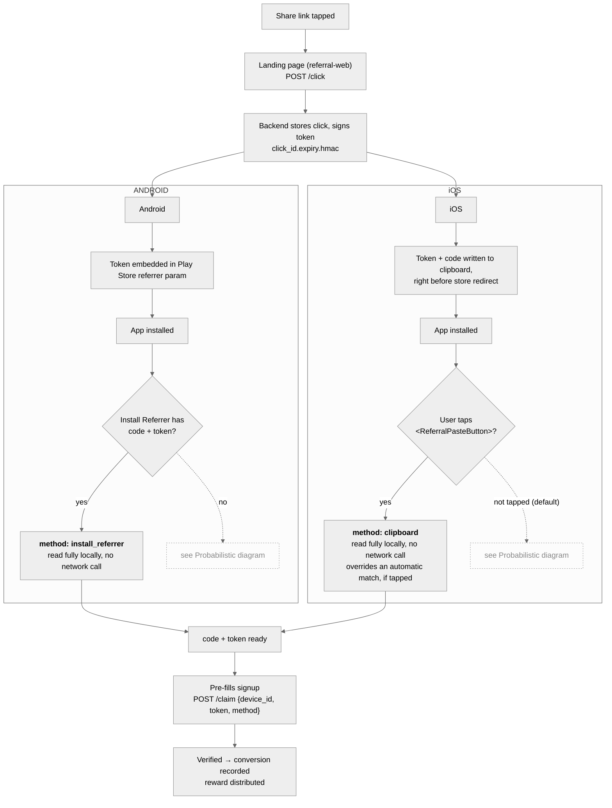
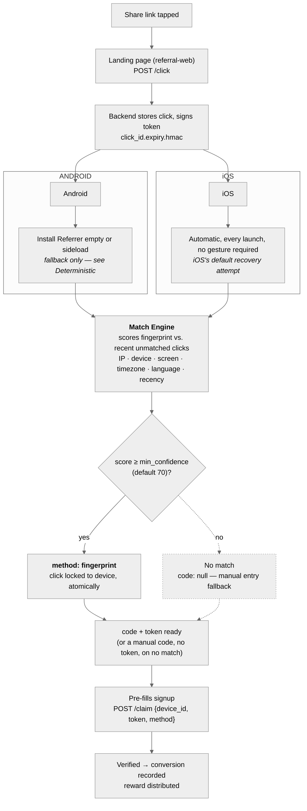

# Recovery paths

How a referral code survives the gap between a tapped link and a first
app launch. Deterministic and probabilistic recovery are two separate
mechanisms, not two branches of one path — shown here as two diagrams,
both starting at the same click and ending at the same claim. This is
the detailed version of the flow summarized in
[`README.md`](README.md#the-flow-these-four-pieces-implement-together).

## Deterministic recovery

Android's default path, and iOS's opt-in path — both read a code and
proof entirely on-device, no network call. Neither touches fingerprint
matching at all.

## Probabilistic recovery

Reached only when the deterministic path above didn't run or didn't have
anything to read — a scored guess, backed by the same signed token once
it succeeds. Both platforms feed the same scoring engine; this is the one
piece of matching logic that isn't platform-specific at all.

## Reliability

- **Deterministic** — Android: ~100% of real installs. iOS: requires an
  explicit tap, so coverage depends entirely on whether
  `<ReferralPasteButton>` is rendered and tapped.
- **Probabilistic** — an observed ~85–90% match rate on iOS, where it's
  the default; lower priority on Android, where it's a fallback of last
  resort.

## The proof that makes both deterministic paths possible

Every recovered code carries a signed proof (`click_id.expiry.hmac`),
minted once at `/click` — this is what lets both deterministic paths
stay genuinely network-free at recovery time, and what `/claim` verifies
before any reward is paid out. A code with no valid token behind it
(including one a user typed in by hand) can reach signup, but can never
clear `/claim` — see [`docs/decisions.md`](../decisions.md) #21/#22 for
the full reasoning behind why this replaced an earlier redeem-round-trip
design.
