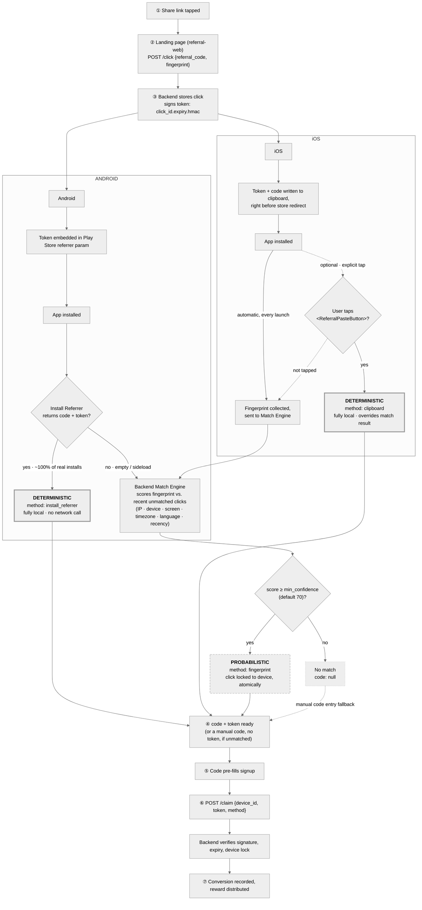

# Recovery paths

How a referral code survives the gap between a tapped link and a first
app launch — four recovery paths across two platforms, converging on one
backend and one claim. This is the detailed version of the flow summarized
in [`README.md`](README.md#the-flow-these-four-pieces-implement-together).

A share link is registered as a click and signed once, for free. Android
and iOS then recover it through different means — the same
deterministic/probabilistic split repeats on both, but which one is the
*default* differs: Android's deterministic path runs automatically, iOS's
needs an explicit tap. Every path — however the code was recovered —
converges on the same claim step before a reward is ever paid out.

## The four paths

### Android · deterministic · `install_referrer`

The default, automatic path — no user action needed beyond installing the
app.

- Code + signed token ride in the Play Install Referrer string, set at
  store-redirect time.
- Read once on first launch, entirely on-device — no network call to
  recover it.
- Reliable near-100% of real installs; only empty on a sideload or a
  referrer Play strips.

### Android · probabilistic · `fingerprint` (fallback)

Only reached if the Install Referrer comes back empty.

- Same scoring engine as iOS's automatic path — one backend, shared code.
- Scores IP, device/OS, screen, timezone, language, and click recency
  against unmatched clicks.
- Needs ≥ 70/100 to count as a match; the winning click locks to the
  device atomically.

### iOS · deterministic · `clipboard`

The stronger path, but not automatic — Apple's paste APIs require an
explicit tap.

- Code + token written to the system clipboard right before the App
  Store redirect.
- Only readable from a real user gesture on `<ReferralPasteButton>` — no
  auto-run.
- Overrides whatever the automatic fingerprint match already found, if
  it's tapped.

### iOS · probabilistic · `fingerprint` (default)

iOS's only fully automatic path — Apple exposes nothing
install-referrer-equivalent.

- Fires on every first launch, no user action required.
- Safari's UA never exposes device model, so the "device" signal
  collapses to OS family + version.
- Accepted trade-off behind an observed ~85–90% iOS match rate.

## The proof that makes both local-only paths possible

Every recovered code carries a signed proof (`click_id.expiry.hmac`),
minted once at `/click` — this is what lets the two deterministic paths
stay genuinely network-free at recovery time, and what `/claim` verifies
before any reward is paid out. A code with no valid token behind it
(including one a user typed in by hand) can reach signup, but can never
clear `/claim` — see [`docs/decisions.md`](../decisions.md) #21/#22 for
the full reasoning behind why this replaced an earlier redeem-round-trip
design.
